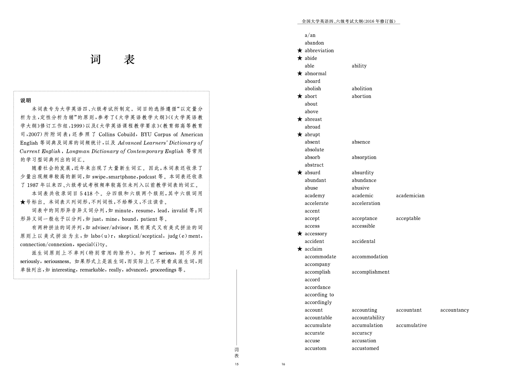

# cet-word-list
英语6级(CET-6)，英语4级（CET-4）词表

## 使用说明
- 词表保存在word-list.txt中
- 需要英语6级(CET-6)，英语4级（CET-4）词表请直接从word.txt文件获取

## 词表的来源
- 本项目中所列的单词列表来自于[《全国大学英语四、六级考试大纲（2016年修订版）》](https://cet.neea.edu.cn/res/Home/1704/55b02330ac17274664f06d9d3db8249d.pdf)

- 在上面说的pdf中列出了英语6级和4级考试时的不包含释义的单词表

- 【词表获取方式】（1）从pdf截图出图片 （2）使用[白描web版](https://web.baimiaoapp.com/)提供的“图片识别文字”服务将截图进行批量识别 （3）将识别结果保存在word-list.txt文件中