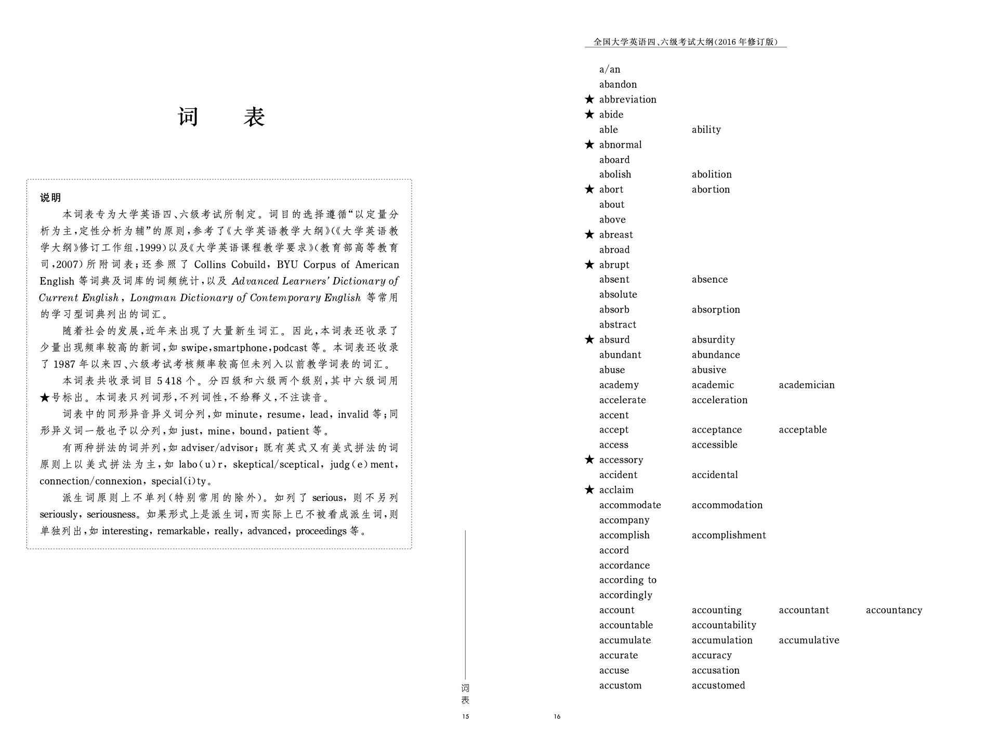

# cet-word-list
- 英语六级(CET-6)，英语四级（CET-4）单词列表
- 标签：英语六级、英语四级、CET6、CET4

## 使用说明
- 词表保存在根目录的[word-list.txt](https://github.com/JavaProgrammerLB/cet-word-list/blob/master/word-list.txt)中
- 需要英语6级(CET-6)，英语4级（CET-4）词表请直接从word-list.txt文件获取

## 词表的来源
- 本项目中所列的单词列表来自于[《全国大学英语四、六级考试大纲（2016年修订版）》](https://cet.neea.edu.cn/res/Home/1704/55b02330ac17274664f06d9d3db8249d.pdf)

- 在上面说的pdf中列出了英语6级和4级考试时的不包含释义的单词表


- 【词表获取方式】
1. 把pdf下载到本地
2. 使用cursor，输入提示词
```
帮我把《55b02330ac17274664f06d9d3db8249d.pdf》文档里的《词表》整理出来，放在根目录一个word-list.txt文件中，去掉里面的五星号，然后保留和原来的pdf一样，原来的一行有什么内容，这一行也是有什么内容，只要词表，除了词表不要任何别的说明
```
